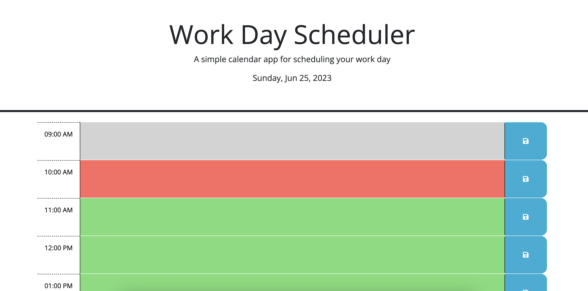

# 05 Third-Party APIs: Work Day Scheduler

## Link to Deployed Application

A link to the deployed application can be found here: https://annalisedev.github.io/workdayplanner/Develop/

## Description

This week's Challenge required the code to be built for the javascript file for a simple calendar application that allows a user to save events for each hour of a typical working day from 9am to 5pm. The app runs in the brower and features dynamically updated HTML and CSS powered by jQuery. Day.js is also leveraged to work with the date and time. It required read throughs of documentation in order to get the functions working appropriately and ensuring the logic was build in the script.js file not the html. Minor changes were made to the HTML file, none were made to the CSS file, and majority of inputs were in the script.js file. I have added comments within the code to describe what each part is achieving. The calendar saves entries to local storage and overrides and new updates a user makes.

The page meets the acceptance criteria provided in the challenge. It has a clean, polished and responsive user interface. It runs in the broswer and features dynamically updating HTML, CSS and JS code that I have written.

The Github Repository can be found here: https://github.com/annalisedev/workdayplanner 

## Screenshot

A screenshot of the deployed application can be found in assets:

## Support

I also used the weekly activities considerably as I solved issuses of challenges I had. The below sites supported me in helping deal with particular challenges which were outside the class content. No other code was copied.

Site used to append the details from the loop
https://stackoverflow.com/questions/32448992/jquery-append-in-for-loop 

Site used to remove any current values in local storage and allow user to replace (splice method)
https://stackoverflow.com/questions/51724323/javascript-removing-object-from-array-by-key-value